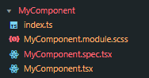

# my-blueprints

My own blueprints for Vs Code.

## Templates

### React functional Component (JS and TS)

Creates a react component within its own Folder. It includes:

- Index file
- Jest spec file with snapshot test
- Sass module file
- Functional component file

### C4 PlantUML Diagrams

Creates C4 diagrams with the basic shapes:

- Context Diagram
- Container Diagram
- Component Diagram

# Usage

1. Install the [Blueprint](https://marketplace.visualstudio.com/items?itemName=teamchilla.blueprint) VS code extension
2. Clone this repo on any folder
3. Set the `blueprint.templatesPath` setting to the `blueprint-templates` folder path

Now you can right-click on any folder and create templates in vs-code.
